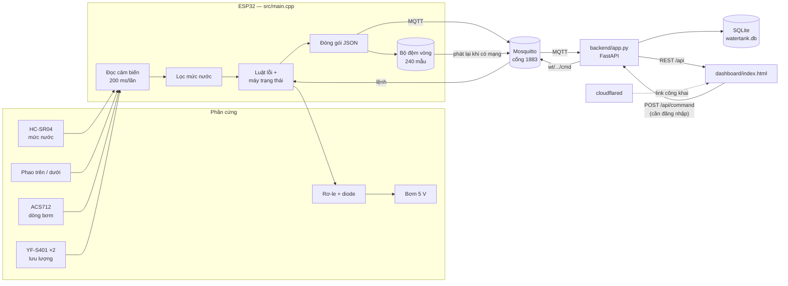
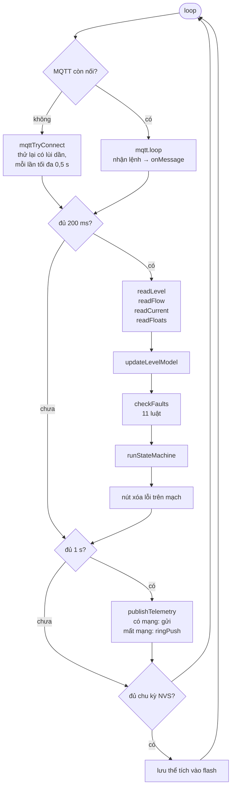
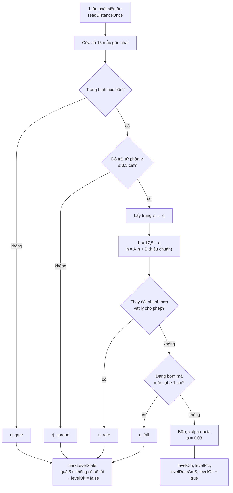
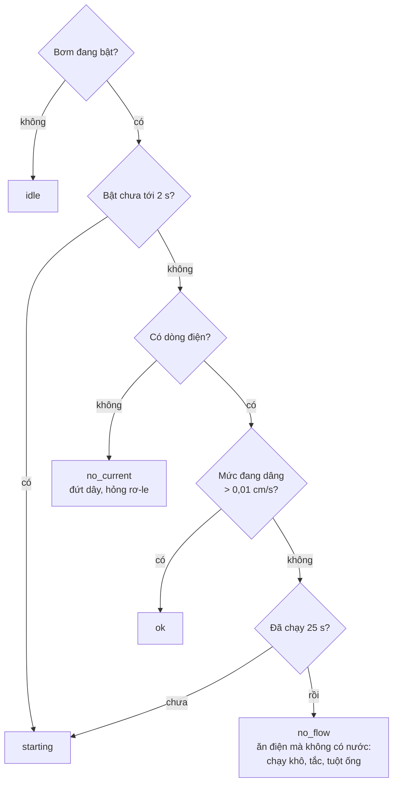
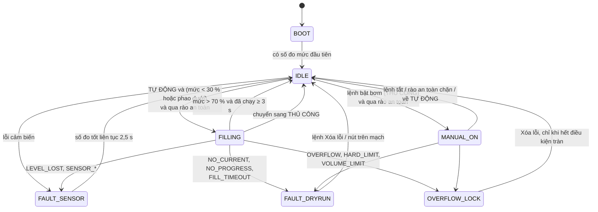
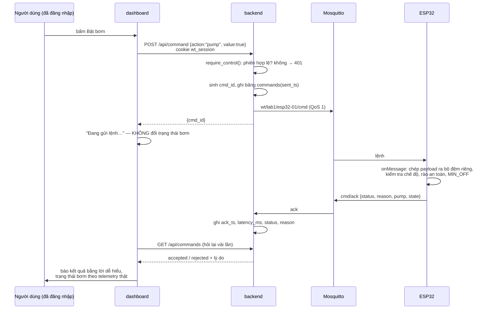
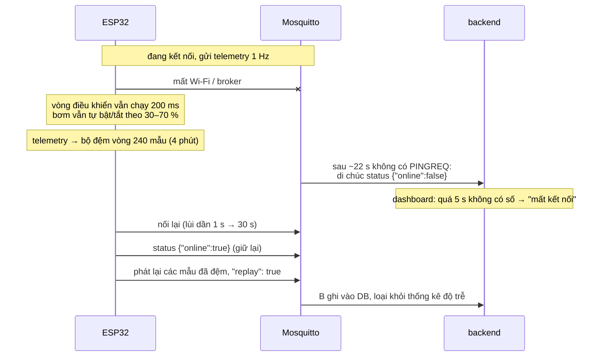
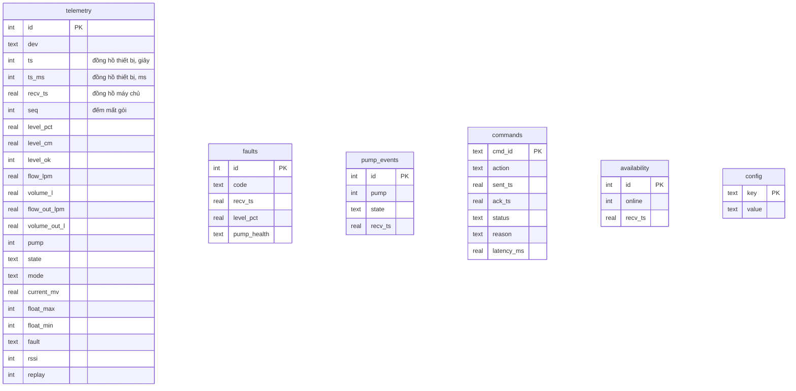

# Đọc hiểu mã nguồn trong một buổi

Tài liệu cho người **mới mở dự án lần đầu**. Đọc từ trên xuống: trước hết là bức tranh toàn cảnh, sau đó đi theo đường đi của **một con số** (mức nước) và **một cái bấm nút** (bật bơm) qua từng tầng, cuối cùng là bản đồ từng file.

Sơ đồ viết bằng Mermaid. GitHub và VS Code (tiện ích *Markdown Preview Mermaid Support*) vẽ được trực tiếp.

---

## 1. Dự án này làm gì

Một bồn nước nhỏ (đáy 10 × 10 cm, cao 17,5 cm) có:

- cảm biến siêu âm HC-SR04 đo mức nước từ trên xuống,
- hai phao: phao **trên** báo sắp tràn, phao **dưới** báo sắp cạn,
- một bơm 5 V bơm nước từ bồn nguồn lên, đóng/ngắt qua rơ-le, có diode chống ngược,
- cảm biến dòng ACS712 để biết bơm **có thật sự ăn điện** không,
- hai cảm biến lưu lượng YF-S401 (vào và ra),
- một ESP32 đọc tất cả, **tự quyết định** bật/tắt bơm, và gửi số liệu qua Wi-Fi.

Máy tính chạy broker MQTT, dịch vụ nền Python lưu số liệu vào SQLite, và một trang web để xem và điều khiển. Trang web ra Internet qua đường hầm Cloudflare nên ai có link cũng xem được; muốn bấm nút thì phải có mật khẩu quản trị.

**Ý tưởng quan trọng nhất:** mọi luật điều khiển và luật an toàn nằm trong ESP32. Máy chủ chỉ **xem** và **gửi yêu cầu**. Mất mạng, bồn vẫn tự bơm và tự ngắt đúng ngưỡng.

## 2. Bức tranh toàn cảnh



Chiều **đi lên** (thiết bị → người xem) gọi là *northbound*: telemetry, trạng thái bơm, sự cố, khả dụng. Chiều **đi xuống** gọi là *southbound*: chỉ có lệnh.

## 3. Cây thư mục

```
IOT/                         ← thư mục gốc repo
├── start.sh / stop.sh       chạy / dừng broker + backend + đường hầm
├── LENH.md                  sổ tay lệnh hay dùng
├── IOT/
│   ├── src/main.cpp         ★ firmware ESP32 (≈1300 dòng, đọc kỹ nhất)
│   ├── src/tests/           các chương trình thử từng linh kiện
│   ├── include/config.h     hằng số + mật khẩu Wi-Fi (KHÔNG lên GitHub)
│   ├── include/config.example.h  bản mẫu không có bí mật
│   ├── platformio.ini       env main + các env test_*
│   ├── backend/app.py       ★ dịch vụ nền: MQTT → SQLite → REST
│   ├── backend/simulator.py ESP32 giả để chạy thử khi chưa có mạch
│   ├── dashboard/index.html ★ toàn bộ giao diện, một file, không framework
│   ├── mosquitto/           cấu hình broker, ACL, file mật khẩu
│   ├── tools/               phân tích thí nghiệm, bench.py
│   └── docs/                protocol.md, wiring.md, TESTING.md, file này
├── water-tank-arduino/      cùng firmware nhưng cho Arduino IDE
└── iot-report-en/           báo cáo LaTeX tiếng Anh
```

`water-tank-arduino/water_tank/water_tank_firmware.cpp` là **bản sao** của `IOT/src/main.cpp`. Sửa ở `src/main.cpp` rồi chép sang, đừng sửa hai nơi.

## 4. Firmware — `IOT/src/main.cpp`

### 4.1 Vòng lặp chính

ESP32 không dùng hệ điều hành đa luồng cho logic. Mọi thứ nằm trong `loop()` và **không có lệnh nào được phép chặn lâu**:



Chu kỳ điều khiển 200 ms chạy **dù có mạng hay không**. Mạng chỉ ảnh hưởng nhánh gửi đi.

### 4.2 Đường đi của một số đo mức nước

HC-SR04 đo khoảng cách `d` từ cảm biến xuống mặt nước. Mức nước `h = 17,5 − d`. Nghe đơn giản, nhưng bồn hẹp làm sóng dội thành vách nên số đo thô rất bẩn. Hàm `readLevel()` cho số đo đi qua nhiều cổng, cổng nào cũng có bộ đếm từ chối riêng (`rj_*` trong telemetry) để biết cổng nào đang chặn:



- **Alpha-beta** là bộ lọc hai trạng thái (mức và tốc độ). Nó cho ra cả `levelRateCmS` — tốc độ dâng/hạ — dùng cho phân loại sức khỏe bơm và tính lưu lượng.
- **Mô hình song song** (`updateLevelModel`): một mức nước "ảo" chạy theo công thức `bơm vào − xả ra`, luôn bị kéo về số đo thật. Khi siêu âm mất tín hiệu trong lúc bơm, `controlPct()` dùng mô hình thay số đo, tối đa 45 s. Quá 45 s → lỗi `LEVEL_LOST`.
- **Chặn tràn cứng** `waterTooClose()`: đọc thẳng khoảng cách thô, **không đi qua bộ lọc**. Ba lần liên tiếp nước cách cảm biến < 4,5 cm là khóa bơm. Bộ lọc có hỏng thế nào thì đường này vẫn còn.

### 4.3 Lưu lượng

Hằng số `FLOW_FROM_LEVEL` trong `config.h` chọn nguồn:

- `1` (đang dùng): **dòng vào** = hằng số bơm 0,36 L/phút khi bơm chạy (đã đo bằng tốc độ dâng mức). **Dòng ra** = tốc độ hạ mức × diện tích đáy, chỉ đo khi bơm đã tắt quá 20 s, và **giữ nguyên** trong lúc bơm chạy. Lý do: YF-S401 bị nhiễu dẫn ~1500 Hz khi bơm chạy, và dòng ra thật (0,1 L/phút) thấp hơn ngưỡng đo của nó.
- `0`: đếm xung từ YF-S401 qua ngắt `onFlowPulse`, có bộ lọc xung quá gần nhau.

Thể tích cộng dồn `volumeL`, `volumeOutL` lưu vào flash (NVS) định kỳ nên mất điện không mất số.

### 4.4 Luật lỗi — `checkFaults()`

Chạy mỗi 200 ms, **trước** máy trạng thái, theo thứ tự ưu tiên. Luật nào bắn thì gọi `raiseFault(code)`: ngắt bơm ngay, bật đèn lỗi, gửi bản tin `event/fault` kèm `pump_health` và dòng điện lúc đó.

| Mã | Điều kiện | Nhóm |
|---|---|---|
| `SENSOR_TIMEOUT` | không có số đo mức hợp lệ quá 45 s | cảm biến, tự hồi phục |
| `SENSOR_CONFLICT` | phao trên báo đầy mà siêu âm < 70 %, hoặc phao dưới báo cạn mà siêu âm > 60 % | cảm biến, tự hồi phục |
| `LEVEL_LOST` | đang bơm, mù quá 45 s (trong máy trạng thái) | cảm biến, tự hồi phục |
| `OVERFLOW` | phao trên **hoặc** khoảng cách thô quá gần **hoặc** mức ≥ 85 % | khóa, phải xóa tay |
| `NO_CURRENT` | rơ-le đóng mà dòng < ngưỡng quá 2 s (đứt dây bơm) | khóa |
| `DRY_RUN` | bơm chạy mà cảm biến lưu lượng < 0,25 L/phút quá 6 s (tắt khi `FLOW_FROM_LEVEL=1`) | khóa |
| `NO_PROGRESS` | bơm chạy 90 s mà mức không lên nổi 1,5 cm (chạy khô, tuột ống) | khóa |
| `FILL_TIMEOUT` | một lần bơm quá 240 s | khóa |
| `HARD_LIMIT` | quá 300 s, không điều kiện, không ngoại lệ | khóa |
| `VOLUME_LIMIT` | một lần bơm quá 2,5 L | khóa |
| `LEAK_SUSPECTED` | bơm tắt mà vẫn có dòng chảy vào quá 60 s | chỉ cảnh báo |

**Bất biến:** hễ có mã lỗi thì trạng thái phải là một trạng thái lỗi. Đầu `runStateMachine()` ép điều này mỗi chu kỳ.

### 4.5 Phân loại sức khỏe bơm — `pumpHealth()`

Đây là phần "nâng cao" của đề (nhất quán dòng điện ↔ lưu lượng). Không ngắt bơm, chỉ **gắn nhãn** để người vận hành biết hỏng ở đâu:



### 4.6 Máy trạng thái — `runStateMachine()`



Khoảng trễ 30 %–70 % chính là điều khiển có trễ (hysteresis). Thêm `MIN_OFF` 20 s: tắt rồi phải nghỉ 20 s mới được bật lại, chống đóng cắt liên tục.

### 4.7 Rào an toàn — `pumpBlockReason()`

**Mọi** đường bật bơm (tự động, lệnh tay) đều đi qua `startPump()`, và `startPump()` hỏi `pumpBlockReason()` trước. Hàm trả về lý do từ chối, theo thứ tự: `fault_active`, `float_max_triggered`, `water_too_close`, `overflow_guard`, `level_sensor_invalid`, `min_off_time`. Ở `ST_MANUAL_ON`, hàm này được hỏi lại **mỗi chu kỳ**: chế độ tay không bao giờ vượt được rào.

### 4.8 Đường đi của một cái bấm nút "Bật bơm"



Nguyên tắc: giao diện **không bao giờ tự đổi** công tắc khi người dùng bấm. Nó chỉ hiện điều thiết bị xác nhận.

Chi tiết từng gặp: PubSubClient dùng **chung một bộ đệm** cho gói nhận và gói gửi. Nếu `onMessage` gửi ack trong khi ArduinoJson còn trỏ vào bộ đệm đó, `cmd_id` bị ghi đè. Vì thế `onMessage` chép payload ra mảng cục bộ trước khi phân tích.

### 4.9 Mất mạng



Khi nối lại, ESP32 hỏi mDNS tên máy chủ (`Nolan.local`) để tìm IP broker mới, và thử lần lượt tối đa 3 mạng Wi-Fi khai báo trong `config.h`.

## 5. Backend — `IOT/backend/app.py`

Một file, bốn phần:

1. **Cấu hình và CSDL** (đầu file): tên chủ đề, `SCHEMA`, `init_db()` tự thêm cột mới cho CSDL cũ, ghi đè bảng `config` bằng ngưỡng hiện tại.
2. **`LeakDetector`**: đường nền trượt 48 khe × 30 phút (EWMA). Mỗi khe học lượng nước dùng "bình thường" vào giờ đó; dùng vượt trung bình + 3σ là cảnh báo `LEAK_BASELINE`. Lúc khởi động, `rebuild_leak_baseline()` học lại từ lịch sử trong DB.
3. **Nhận MQTT** (`_on_message`): mỗi chủ đề ghi một bảng — telemetry → `telemetry`, `state/pump` → `pump_events`, `event/fault` → `faults`, `status` → `availability`, `cmd/ack` → cập nhật `commands`. Chạy trong luồng riêng của paho.
4. **REST** (FastAPI):

| Đường dẫn | Việc |
|---|---|
| `GET /` | trả về dashboard |
| `GET /api/latest` | số đo mới nhất + `online` + `age_s` (độ tươi) |
| `GET /api/telemetry?minutes=` | chuỗi thời gian cho biểu đồ |
| `GET /api/volume/daily` | thể tích vào/ra theo ngày (cộng các bước tăng, bỏ qua lúc xóa bộ đếm) |
| `GET /api/faults`, `/api/events`, `/api/commands` | lịch sử |
| `GET /api/leak/baseline` | tình trạng đường nền rò rỉ |
| `GET /api/stats/latency` | độ trễ lệnh khứ hồi và telemetry |
| `POST /api/login`, `/api/logout`, `GET /api/auth` | phiên quản trị bằng mật khẩu |
| `POST /api/command`, `PUT /api/config` | **cần đăng nhập** |

Mật khẩu quản trị đọc từ `~/.cache/water-tank/admin_password` (ngoài repo). Đăng nhập đúng → cookie `wt_session` HttpOnly, SameSite=Strict, Secure khi qua https, sống 7 ngày. Sai 5 lần trong 5 phút → khóa IP đó. Phân quyền **không** dựa vào IP vì qua đường hầm mọi yêu cầu đều đến từ 127.0.0.1.

Lược đồ CSDL:



## 6. Dashboard — `IOT/dashboard/index.html`

Một file HTML + CSS + JavaScript thuần, không build. Các khối:

- **Sơ đồ bồn** (SVG): mực nước, thước 0–14 cm, vạch 30/70/85 %, bơm, ống, phao. Số hiển thị được **nội suy mượt** giữa hai lần nhận và có vùng chết 0,25 cm để không rung.
- **Ô số**: mức, dòng vào, dòng ra, dòng điện (mA) kèm nhãn sức khỏe bơm, thể tích hôm nay.
- **Biểu đồ**: mức và lưu lượng theo thời gian; **thể tích theo ngày** dạng cột.
- **Bảng**: sự cố (có cột Bơm = `pump_health`), sự kiện bơm, lệnh đã gửi.
- **Điều khiển**: ẩn cho tới khi `/api/auth` trả `can_control`. Có ô mật khẩu, nút Tự động/Thủ công, Bật/Tắt bơm, Xóa lỗi, Đặt lại thể tích. Kết quả lệnh báo bằng lời dễ hiểu; bơm đang trong thời gian nghỉ thì nút hiện "Bật bơm · chờ N s".

Vòng làm mới: `/api/latest` mỗi giây, biểu đồ vài giây một lần, thể tích theo ngày 30 s.

## 7. Chạy, sửa, thử

| Việc | Lệnh |
|---|---|
| Chạy tất cả | `./start.sh` (thêm `local` để không mở link công khai) |
| Dừng | `./stop.sh` |
| Nạp firmware | `cd IOT && pio run -e main -t upload` |
| Xem log ESP32 | `pio device monitor` |
| Chạy thử không cần mạch | `backend/simulator.py` (xem `IOT/README.md`) |
| Thử một linh kiện | `pio run -e test_level -t upload` (và các `test_*` khác) |
| Nghe MQTT | `mosquitto_sub -u backend -P backend_pass -t 'wt/#' -v` |
| Phân tích dữ liệu | `tools/analyze_experiments.py`, `tools/bench.py` — xem `docs/TESTING.md` |

Muốn đổi một ngưỡng (ví dụ 30/70 %): sửa `include/config.h`, nạp lại firmware, **và** sửa `DEFAULT_CONFIG` trong `app.py` để dashboard vẽ vạch đúng.

## 8. Những chỗ dễ vấp

- `include/config.h` không có trên GitHub. Sao chép `config.example.h` thành `config.h` rồi điền Wi-Fi.
- ESP32 chỉ thấy Wi-Fi **2,4 GHz**.
- Trên máy này phải chạy Python bằng `env -u PYTHONPATH ...` vì ROS chèn thư viện của nó vào.
- ArduinoJson **cắt cụt âm thầm** khi bộ đệm nhỏ; PubSubClient **từ chối gửi âm thầm** khi gói lớn hơn `setBufferSize`. Thêm trường vào telemetry thì kiểm tra cả hai (hiện 1024 / 1200 byte).
- Link công khai của Cloudflare **đổi mỗi lần** chạy `start.sh`, xem lại trong `~/.cache/water-tank/public_url`.
- Nhật ký các lỗi phần cứng đã gặp và cách xử lý: `docs/wiring.md`. Mỗi đoạn chú thích dài trong `main.cpp` thường kể một lỗi thật đã gặp — đọc chúng trước khi "đơn giản hóa" đoạn mã đó.
